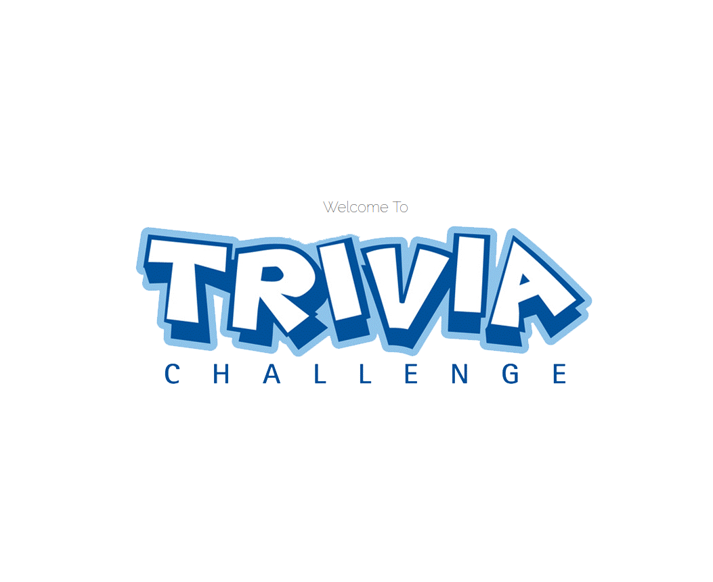
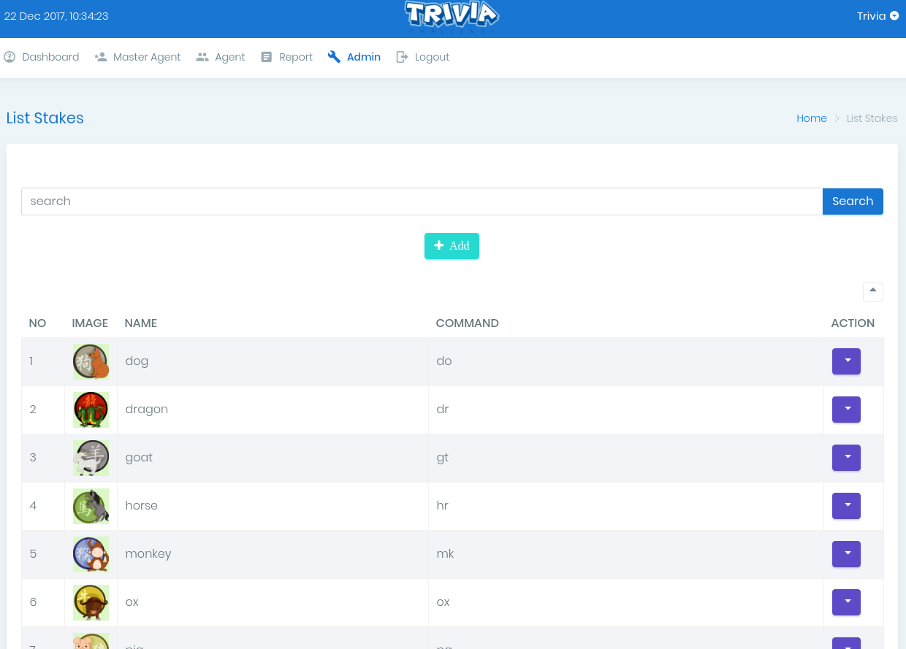
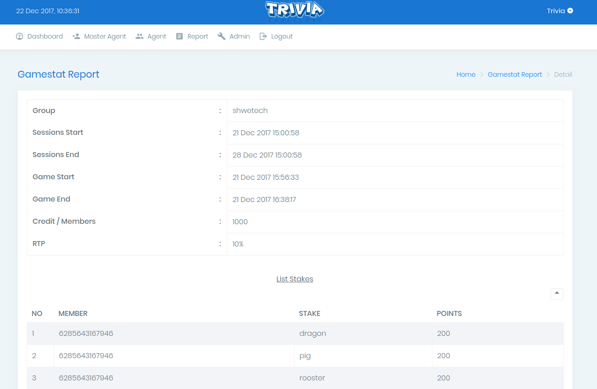

TRIVIA

	

## ABOUT TRIVIA

TRIVIA is a Whatsapp Game Bot. The Game system will be able to let user create their own agent, and play their own game with their friend.

## FEATURES

General feature list for support your business, such as BOT System, Admin and Member Area, and Landing Page.
- Auto Response.
  Once a user type in a valid command, they will get detail information based on their command privately. You can set the detailed information as public that send in group chat
- Easy Register.
  Invite your friend to your group game and let them register by using a simple command
- Game Information
  The BOT will send a message periodically to the Host's group for game information
- Custom Response
  You can modify all Bot's message to be sent to users, with their command setting, in the Admin Panel
- Auto Private Message
  When the player plays a game, the BOT will send a private message for the confirmation
- Attractive Message Format
  The BOT can send a message to the group or private with image attachment for game result or any information
- Member Area Dashboard
  There is a Member Area for master agent and agent to get all information for their player. They can see the report and other detail activities. A agent can manage how many percentage they will take for a Position Taker
- Manage And Get Report
  A host can manage the group name, the period time per session and their position taker each game. They can see thee report such a player statistics, game summary, even the turn over or player point
- 1 Portal For All
  We will create an integrated system for all of our system to let product owner easy to manage their application
- Administrator Page
  As an Administrator, they can manage the data on their master agent and agent. You can edit the game rule also from here. And there is a CMS for your landing page to edit the content
- Landing Page
  A landing page can boost your conversion rate

## PREVIEW :

